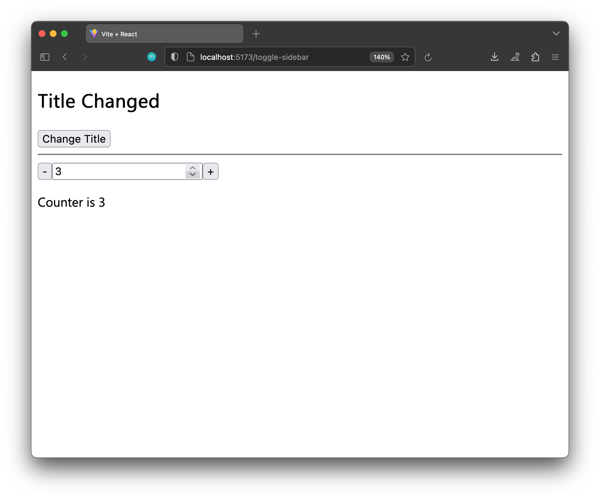

# React useState Example



This is a simple React application that demonstrates the usage of the `useState` hook. The application includes two sections:

1. **Title Section:**
   - The title is initially set to 'Counter'.
   - Clicking the "Change Title" button updates the title to 'Title Changed'.

2. **Counter Section:**
   - The counter is initially set to 0.
   - You can decrement the counter by clicking the '-' button.
   - You can increment the counter by clicking the '+' button.
   - The current counter value is displayed below the buttons.
   - The counter input allows you to manually enter a value.

## `useState` Hook Usage

The `useState` hook is a React hook used for managing state in functional components. In this application, it is used as follows:

### Title State

- `title`: The state variable representing the title.
- `setTitle`: The function to update the title state.
  
```jsx
const [title, setTitle] = useState('Counter');
```

### Counter State
```jsx
const [counter, setCounter] = useState(0);
```

- `counter`: The state variable representing the counter.
- `setCounter`: The function to update the counter state.

### Changing Title

```jsx
<button onClick={() => setTitle('Title Changed')}>Change Title</button>
```

Clicking the "Change Title" button calls the `setTitle` function to update the title state.

### Modifying Counter

```jsx
<button onClick={() => setCounter(counter - 1)}>-</button>
<input
  type="number"
  value={counter}
  onChange={(e) => setCounter(e.target.value)}
/>
<button onClick={() => setCounter(counter + 1)}>+</button>
```

- Clicking the '-' button decrements the counter.
- Entering a value in the input updates the counter.
- Clicking the '+' button increments the counter.