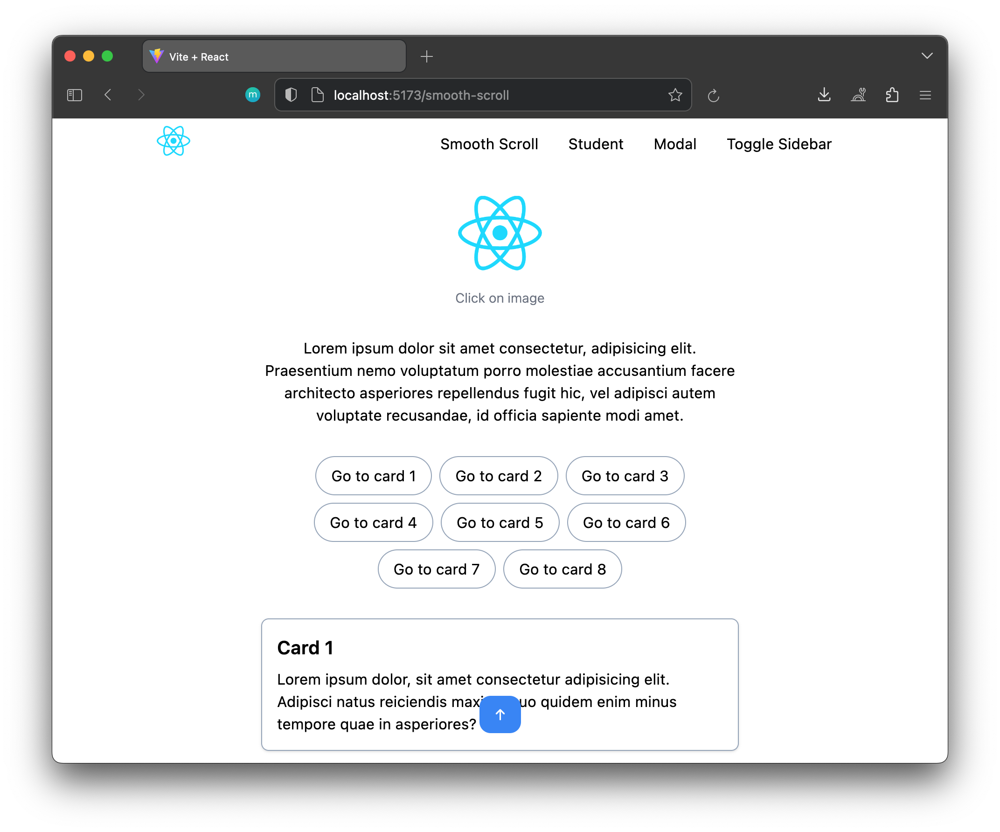
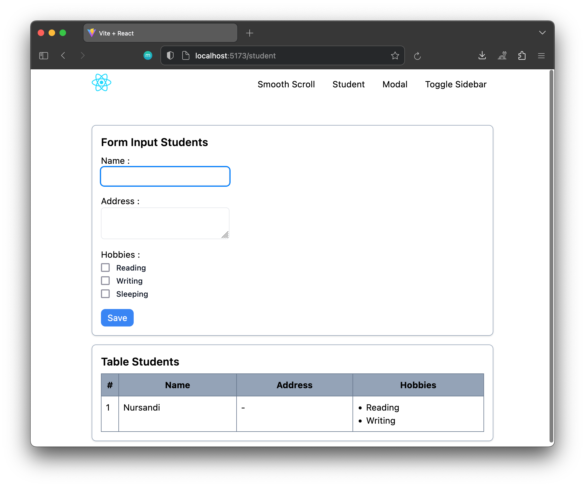
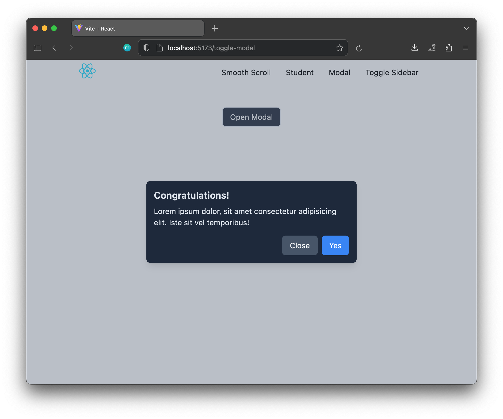
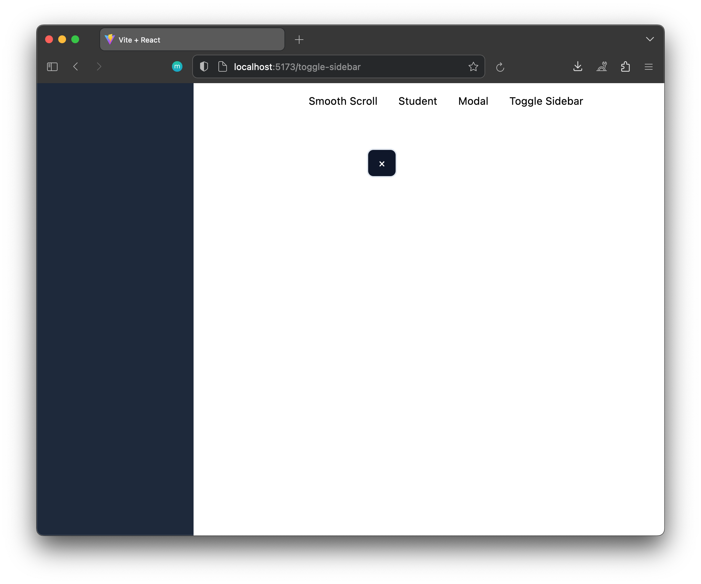

# React useRef Examples

This is a simple React application contains examples of using React's `useRef` hook for various functionalities. The examples include smooth scrolling, form focus, modal handling, and sidebar toggling.

## Example 1: Smooth Scroll

This example demonstrates how to create smooth scroll behavior by clicking on different elements.

Usage:
1. Click on the image to smoothly scroll to a specific section.
2. Click on the "Go to Card" button to smoothly scroll to a card section.
3. Click on the "Scroll to Top" button to smoothly scroll to the top of the page.

## Example 2: Form Focus After Submission

After submitting a form, this example automatically focuses on a specific input field.

Usage:

1. Fill out the form and submit it.
2. After submission, the focus will be automatically set to a designated input field.

## Example 3: Modal Handling

A simple modal component is implemented with the ability to open and close.

Usage:

1. Click on the "Open Modal" button to reveal the modal.
2. Click on the "Close" button inside the modal or outside the modal to close it.

## Example 4: Toggle Sidebar

A sidebar can be toggled open and closed.

Usage:

1. Click on the "Toggle Sidebar" button to open or close the sidebar.