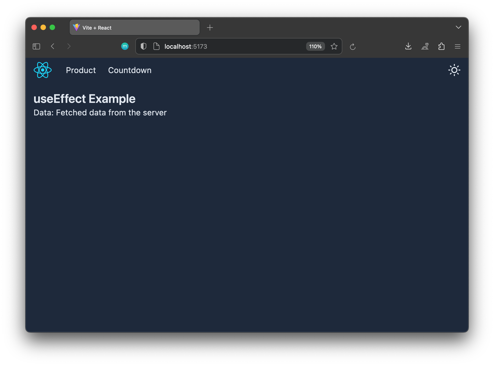
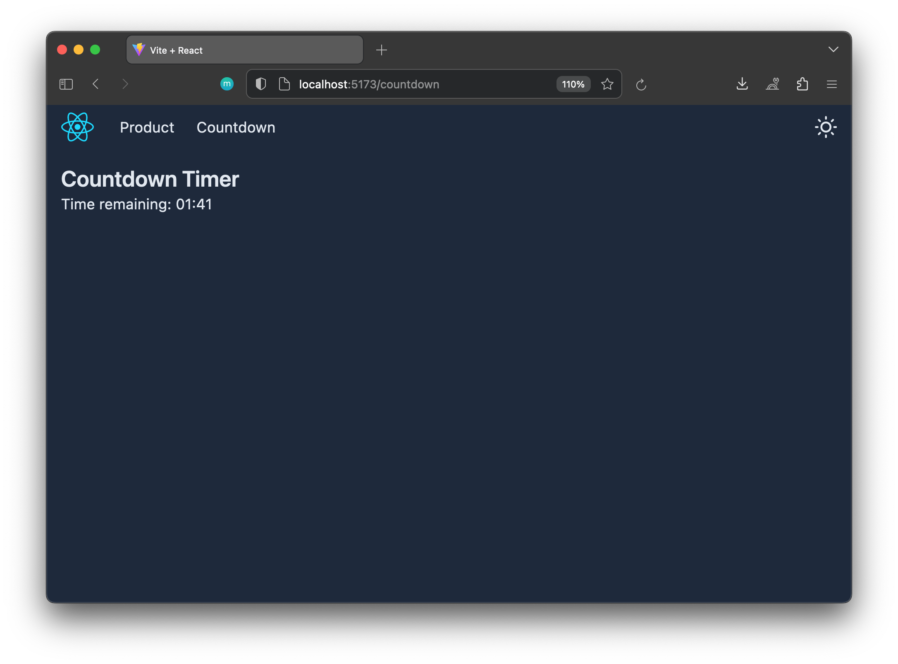

# React Context Examples

This is a simple React application contains examples of using React's useContext hook for various functionalities. The examples is similar like previous project include simple useEffect, countdown timer, CRUD operations.

## 1. Countdown Timer

A simple React component showcasing a countdown timer using the `useContext` hook.

Check the [countdown.jsx](./src/pages/countdown.jsx) file for the code.

## 2. CRUD Operations with JSON Server

A React application demonstrating CRUD operations using JSON Server as a fake REST API.

Check the [product.jsx](./src/pages/product.jsx) file for the code.

### How to Run
1. Install json server if you are not already installed
2. Run `json-server -w db.json --port=8000` to start the JSON Server (fake REST API).

## 3. Fetch data from useContext

Write your own custom React component utilizing the `useContext` hook.

Check the [home.jsx](./src/pages/home.jsx) file for the code.

## 4. Toggle Theme

A simple condition using `useContext` how to switch theme from light to dark