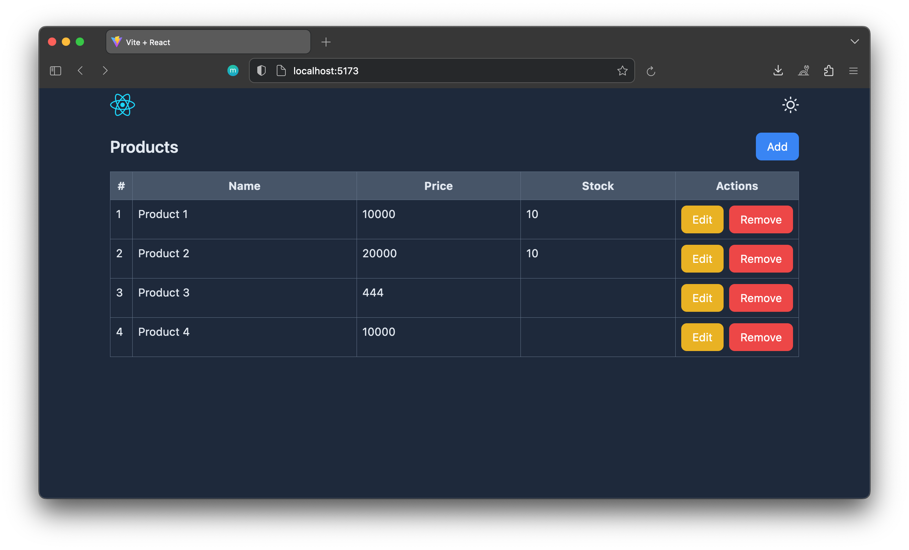

# React useReducer Example



This example demonstrates how to use React's `useReducer` hook for managing product data in a React application. The application involves CRUD operations for products, using a fictional API.

### ProductProvider

The `ProductProvider` component wraps your application and provides the necessary context for managing products.

Check the [product.context.jsx](./src/context/product.context.jsx) file for the code.

```jsx
import { ProductProvider } from './path-to-your-context-file'

export default function Product() {
  return (
    <ProductProvider>
      {/* Your application components */}
    </ProductProvider>
  );
}
```

### Hooks

The `useProductContext` hook allows you to access the product-related state and functions in your components.

```jsx
import { useProductContext } from './path-to-your-context-file'

const { state, refreshProducts, dispatch, modalCreateRef, modalEditRef } = useProductContext()
```

### Actions and Reducer

The reducer function in your context file handles different actions related to products. The actions include initializing products, setting product details, resetting product state, and opening/closing modals.

### API Functions

Functions like getProducts, createProduct, getProduct, updateProduct, and removeProduct interact with a fictional API to perform CRUD operations on products.

### How to Run
1. Install json server if you are not already installed
2. Run `json-server -w db.json --port=8000` to start the JSON Server (fake REST API).
